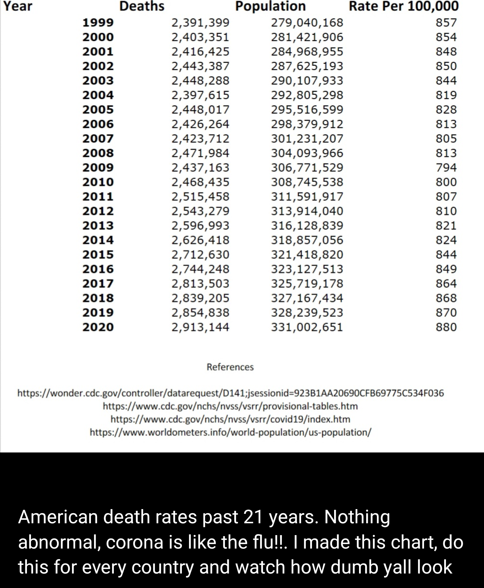

# Covid Mortality and Disinformation - (Part 1)
Recently, I was scrolling through social media when I saw a post that gave me pause. The social media post is presented below:

<div>

</div>

The post caught my attention for three reasons: (1) it presented a falsifiable hypothesis, (2) the conclusion was counter-intuitive, and (3) there was an obvious challenge issued. Anyone reading this knows that falsifiable hypotheses are exciting because they deal with evidence and once we agree on the evidence, some hypotheses can be disproven with evidence. Here the falsifiable hypothesis is also the counter-intuitive conclusion, namely that COVID-19 has not affected mortality rates in the United States ("Nothing abnormal [about 2020 mortality rates], corona is like the flu"). What really spurred this blog post to be written was the message being sent in the last sentence of the blog post and the associated references below the table. The implicit challenge was that given data sources, one could also determine that mortality rates had not changed in the U.S. or other countries. As Barney Stinson would say, "Challenge Accepted!"

The comparative concept at play in the mortality claims from social media is: "How bad is this year's mortality rate compared to previous mortality rates?". We can operationalize this concept as mortality rate change and create it by comparing the morality rate for each year (y) to the mortality rate in the previous year (y-1):

$$\text{Mortality Rate Change}_{y}= \frac{\text{Mortality Rate}_{y}-\text{Mortality Rate}_{y-1}}{\text{Mortality Rate}_{y-1}}$$

After creating the morality rates for 2014 to 2020, I concluded that the mortality rate change for 2020 is 12 times greater than the average mortality rate change from 2014 to 2019. In short, the falsifiable hypothesis that was presented in the social media post (2020 mortality rates are normal), was falsified; the mortality rate change in 2020 was far from the average.

To lead others interested in getting the data themselves and drawing their own conclusions, I created a multi-part blog series. All code to recreate these analyses will eventually be available on [my Github account](https://github.com/kpolimis/). This blog post represents the first in an attempt to investigate the COVID-19 mortality claims made on social media. To understand changes in U.S. mortality over time, we need to gather (1): U.S. mortality data and (2): U.S population data. Then, we need to (3) create mortality rates with these data sources. Lastly, we need to (4) compare the mortality rates from the social media post to the mortality data obtained from government sources. In this post we complete step 1, gather U.S. mortality data.

Government mortality and population data is available via the open data portal [Socrata](https://www.tylertech.com/products/socrata). You can sign up for a Socrata account [here](https://support.socrata.com/hc/en-us/articles/115004055807-Signing-up-for-an-Account) and create a developer application to programmatically download Socrata data by following these [instructions](https://support.socrata.com/hc/en-us/articles/210138558-Generating-an-App-Token)

Once you have established your Socrata Developer credentials, you can leverage an R package that connects to the Socrata API called [RSocrata](https://cran.r-project.org/web/packages/RSocrata/index.html)

First, let's load the libraries we will need for the analysis
``` {.r}
library(here)
library(yaml)
library(RSocrata)
library(tidyverse)
```

Then let's bring in our Socrata credentials from a local file called `socrata_app_credentials.yml`:

``` {.r}
socrata_app_credentials = yaml.load_file(here("credentials/socrata_app_credentials.yml"))
```

contents of `socrata_app_credentials.yml`:
``` {.r}
app_token: "APP_TOKEN"
email: "EMAIL"
password: "PASSWORD"
```

Yearly mortality from 1999 to 2020 does not exist in one dataset, so we will need to combine 3 government datasets to create our own data to answer the challenge presented in the social media post. The first government dataset is [yearly mortality data from 1999 to 2017](https://data.cdc.gov/NCHS/NCHS-Leading-Causes-of-Death-United-States/bi63-dtpu) from the [National Center for Health Statistics](https://www.cdc.gov/nchs/about/50th_anniversary.htm) (NCHS). The NCHS is a part of the Centers for Disease Control and Prevention (CDC) and provides statistical information for public health policies. The documentation for the NCHS data is available [here](https://www2.census.gov/programs-surveys/popest/technical-documentation/methodology/2010-2020/methods-statement-v2020-final.pdf)

``` {.r}
#' Yearly Counts of Deaths by State and Select Causes, 1999-2017
yearly_deaths_by_state_1999_2017 <- read.socrata(
  "https://data.cdc.gov/resource/bi63-dtpu.json",
  app_token = socrata_app_credentials$app_token,
  email = socrata_app_credentials$email,
  password  = socrata_app_credentials$password
)
```

Then we get [weekly state mortality data from 2014-2018](https://data.cdc.gov/NCHS/Weekly-Counts-of-Deaths-by-State-and-Select-Causes/3yf8-kanr)
``` {.r}
#' Weekly Counts of Deaths by State and Select Causes, 2014-2018
weekly_deaths_by_state_2014_2018 <- read.socrata(
  "https://data.cdc.gov/resource/3yf8-kanr.json",
  app_token = socrata_app_credentials$app_token,
  email = socrata_app_credentials$email,
  password  = socrata_app_credentials$password
)
```

We follow that up with the [weekly state mortality data from 2019-2020](https://data.cdc.gov/NCHS/Weekly-Counts-of-Deaths-by-State-and-Select-Causes/muzy-jte6) from NCHS. From the [NCHS documentation](https://www2.census.gov/programs-surveys/popest/technical-documentation/methodology/2010-2020/methods-statement-v2020-final.pdf) we learn that the 2019 and 2020 counts of death are provisional and not yet complete because of a data lag:

> In general, the births and deaths data we receive from NCHS have a two-year lag. This means that the most recent data we have on births and deaths by geographic and demographic detail for each vintage of estimates refer to the calendar year two years prior to the vintage year. For example, the most current full-detail births and deaths data we used in Vintage 2020 were from calendar year 2018. We also receive preliminary or provisional NCHS total numbers of births and deaths at the national level for the year prior to the vintage (in this example, 2019). Using these data and the data received from the [The Federal-State Cooperative for Population Estimates (FSCPE)], we create short-term projections that approximate the final NCHS data by characteristics, the preliminary NCHS national totals, and the FSCPE data (where available) by geographic distribution. (pg. 4)

This point is important because in the future counts of death may be revised upward or downward and could change the conclusions drawn in this post.

``` {.r}
#' Weekly Counts of Deaths by State and Select Causes, 2019-2020
weekly_deaths_by_state_2019_2020 <- read.socrata(
  "https://data.cdc.gov/resource/muzy-jte6.json",
  app_token = socrata_app_credentials$app_token,
  email = socrata_app_credentials$email,
  password  = socrata_app_credentials$password
)
```

`glimpse` of the yearly mortality dataset
``` {.r}
glimpse(weekly_deaths_by_state_2019_2020)
```


```
## Rows: 5,616
## Columns: 34
## $ jurisdiction_of_occurrence              <chr> "Alabama", "Alabama", "Alab...
## $ mmwryear                                <chr> "2019", "2019", "2019", "20...
## $ mmwrweek                                <chr> "1", "2", "3", "4", "5", "6...
## $ week_ending_date                        <chr> "2019-01-05", "2019-01-12",...
## $ all_cause                               <chr> "1077", "1090", "1114", "10...
## $ natural_cause                           <chr> "993", "994", "1042", "994"...
## $ septicemia_a40_a41                      <chr> "30", "25", "22", "21", "18...
## $ malignant_neoplasms_c00_c97             <chr> "198", "187", "238", "165",...
## $ diabetes_mellitus_e10_e14               <chr> "22", "24", "18", "22", "19...
## $ alzheimer_disease_g30                   <chr> "60", "49", "48", "50", "52...
## $ influenza_and_pneumonia_j09_j18         <chr> "21", "18", "31", "22", "19...
## $ chronic_lower_respiratory               <chr> "63", "85", "80", "113", "8...
## $ other_diseases_of_respiratory           <chr> "14", "21", "30", "14", "20...
## $ nephritis_nephrotic_syndrome            <chr> "21", "13", "25", "25", "24...
## $ symptoms_signs_and_abnormal             <chr> "27", "11", "15", "23", "21...
## $ diseases_of_heart_i00_i09               <chr> "261", "275", "283", "279",...
## $ cerebrovascular_diseases                <chr> "53", "65", "53", "56", "50...
## $ covid_19_u071_multiple_cause_of_death   <chr> "0", "0", "0", "0", "0", "0...
## $ covid_19_u071_underlying_cause_of_death <chr> "0", "0", "0", "0", "0", "0...
## $ flag_otherresp                          <chr> NA, NA, NA, NA, NA, NA, NA,...
## $ flag_otherunk                           <chr> NA, NA, NA, NA, NA, NA, NA,...
## $ flag_nephr                              <chr> NA, NA, NA, NA, NA, NA, NA,...
## $ flag_inflpn                             <chr> NA, NA, NA, NA, NA, NA, NA,...
## $ flag_cov19mcod                          <chr> NA, NA, NA, NA, NA, NA, NA,...
## $ flag_cov19ucod                          <chr> NA, NA, NA, NA, NA, NA, NA,...
## $ flag_sept                               <chr> NA, NA, NA, NA, NA, NA, NA,...
## $ flag_diab                               <chr> NA, NA, NA, NA, NA, NA, NA,...
## $ flag_alz                                <chr> NA, NA, NA, NA, NA, NA, NA,...
## $ flag_clrd                               <chr> NA, NA, NA, NA, NA, NA, NA,...
## $ flag_stroke                             <chr> NA, NA, NA, NA, NA, NA, NA,...
## $ flag_hd                                 <chr> NA, NA, NA, NA, NA, NA, NA,...
## $ flag_neopl                              <chr> NA, NA, NA, NA, NA, NA, NA,...
## $ flag_natcause                           <chr> NA, NA, NA, NA, NA, NA, NA,...
## $ flag_allcause                           <chr> NA, NA, NA, NA, NA, NA, NA,...
```

NCHS datasets often contain mortality data for more  geographic regions than just U.S. states (e.g., national data, or data from Puerto Rico and New York City). We want to filter to only data in the 50 states, the District of Columbia, and the United States. Create a variable leveraging the `R` built-in `state.name` to create a list of all state names, the District of Columbia, and the United States and filter mortality data with this list

``` {.r}
state.name_dc_us = c(state.name, "District of Columbia", "United States")
state.abb_dc_us = c(state.abb, "DC", "US")
```

Our goal is to create a yearly 1999 to 2020 mortality data by combining the yearly mortality data from 1999 to 2017 with the weekly 2014 to 2018 data and the weekly 2019 to 2020 data. First, we perform some pre-processing by (1) renaming columns, (2) filtering to only the "All causes" and regions captured in `state.name_dc_us` list, and (3) subsetting columns.

``` {.r}
yearly_deaths_by_state_1999_2017_subset = yearly_deaths_by_state_1999_2017 %>%
  rename('state_name'='state', 'all_deaths'='deaths') %>%
  filter(cause_name=="All causes" & state_name %in% state.name_dc_us) %>%
  select(state_name, year, all_deaths)
```

Then we combine the weekly 2014-2018 data with the 2019-2020 data with similar pre-processing.
``` {.r}
weekly_deaths_2014_2020 = weekly_deaths_by_state_2014_2018 %>%
  select(jurisdiction_of_occurrence, mmwryear, allcause, weekendingdate) %>%
  rename('state_name'='jurisdiction_of_occurrence', 'all_cause_deaths'='allcause',
         'year'='mmwryear', 'week_ending_date' = 'weekendingdate') %>%
  mutate(week_ending_date = as.character(week_ending_date)) %>%
  rbind(weekly_deaths_by_state_2019_2020 %>%
          rename('state_name'='jurisdiction_of_occurrence', 'year'='mmwryear', 'all_cause_deaths'='all_cause') %>%
          select(state_name, year, all_cause_deaths, week_ending_date)) %>%
  filter(state_name %in% state.name_dc_us) %>%
  arrange(state_name, year)
```

Create yearly mortality data for states and U.S. from 2018 to 2020
``` {.r}
yearly_deaths_by_state_2018_2020 = weekly_deaths_2014_2020 %>%
  filter(year>=2018) %>%
  group_by(state_name, year) %>%
  mutate(all_deaths = sum(as.numeric(all_cause_deaths), na.rm = TRUE)) %>%
  select(state_name, year, all_deaths) %>%
  distinct() %>%
  ungroup()
```

Now we can produce a yearly mortality dataset for states and U.S. from 1999 to 2020 by combining our two yearly datasets from 1999 to 2017 and 2018 to 2020

``` {.r}
yearly_deaths_by_state_1999_2020 = rbind(yearly_deaths_by_state_1999_2017_subset,
                                         yearly_deaths_by_state_2018_2020) %>%
  arrange(year)

```

View of `yearly_deaths_by_state_1999_2020`

```
## # A tibble: 6 x 3
##   state_name  year all_deaths
##   <chr>      <dbl>      <dbl>
## 1 Alabama     1999      44806
## 2 Alaska      1999       2708
## 3 Arizona     1999      40050
## 4 Arkansas    1999      27925
## 5 California  1999     229380
## 6 Colorado    1999      27114
```

In the next blog post, we will gather the population U.S. population data necessary to create mortality statistics.
