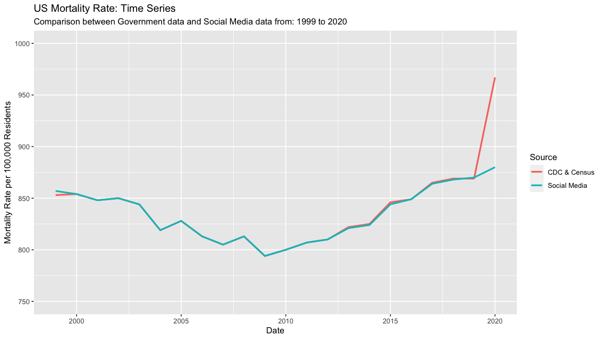
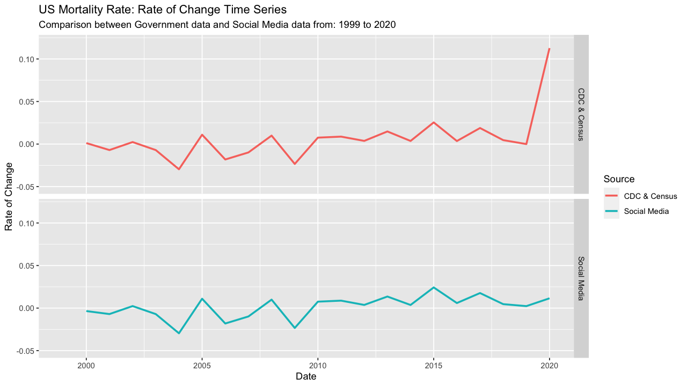
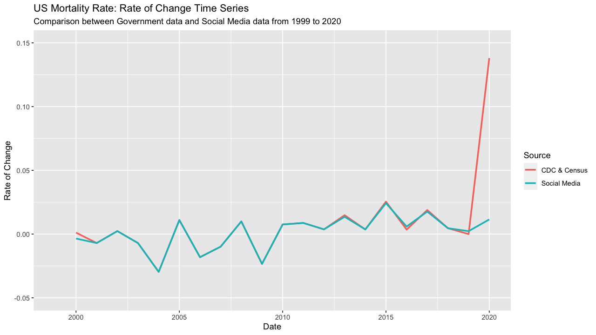
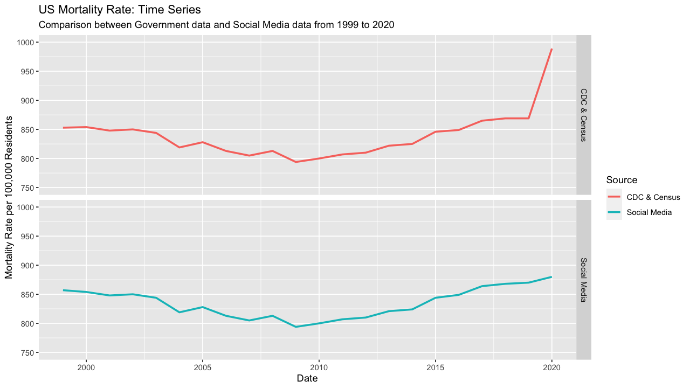

# Covid Mortality and Disinformation - (Part 4)

As part of our investigation into mortality rates reported on social media and mortality data created by combining government data sources, we've now completed 3 steps. First, we [downloaded mortality data](http://kivanpolimis.com/covid-19-mortality-and-disinformation-part-1.html) from the [National Center for Health Statistics](https://www.cdc.gov/nchs/about/50th_anniversary.htm) (NCHS) from 1999 to 2020. Then we [downloaded population data](http://kivanpolimis.com/covid-19-mortality-and-disinformation-part-2.html) from the Census from 1999 to 2020. Using the mortality and population data, we [created mortality rates](http://kivanpolimis.com/covid-19-mortality-and-disinformation-part-3.html). Now that we have mortality rates, we can compare the mortality data we have with the mortality data reported on social media that spurred this blog series.

load libraries
``` {.r}
library(here)
library(reshape2)
library(lubridate)
library(tidyverse)
```

Our mortality data is stores in the .csv `mortality_time_series_national.csv`. I manually coded the table reported in the social media blog post in the .csv `social_media_mortality_data.csv`.
``` {.r}
mortality_time_series_national = read_csv(here("output/mortality_time_series_national.csv"))
social_media_mortality_data = read_csv(here("data/social_media_mortality_data.csv"))
```

Let's add a column `source` to each dataset so that we can tell the data sources apart when we create a comparison data set
``` {.r}
mortality_time_series_national$source = "CDC & Census"
social_media_mortality_data$source = "Social Media"
```

Quick look at the datasets. We can see that they have identical column names and the same amount of observations.
``` {.r}
glimpse(mortality_time_series_national)
glimpse(social_media_mortality_data)
```

```
## Rows: 44
## Columns: 5
## $ state_name <chr> "United States", "United States", "United States", "Unit...
## $ variable   <chr> "pop_estimate", "pop_estimate", "pop_estimate", "pop_est...
## $ value      <dbl> 280466621, 281424600, 284968955, 287625193, 290107933, 2...
## $ year       <dbl> 1999, 2000, 2001, 2002, 2003, 2004, 2005, 2006, 2007, 20...
## $ source     <chr> "CDC & Census", "CDC & Census", "CDC & Census", "CDC & C...
```

```
## Rows: 44
## Columns: 5
## $ state_name <chr> "United States", "United States", "United States", "Unit...
## $ year       <dbl> 1999, 2000, 2001, 2002, 2003, 2004, 2005, 2006, 2007, 20...
## $ variable   <chr> "pop_estimate", "pop_estimate", "pop_estimate", "pop_est...
## $ value      <dbl> 279040168, 281421906, 284968955, 287625193, 290107933, 2...
## $ source     <chr> "Social Media", "Social Media", "Social Media", "Social ...
```

Combine our curated mortality data with social media mortality data into one long mortality dataset.
``` {.r}
mortality_comparison_data_long = rbind(mortality_time_series_national, social_media_mortality_data)
```

Create a wide combined mortality dataset and add three comparison variables: (1) the mortality rate, (2) the mortality rate lag, and (3) the rate of change for the mortality rate
``` {.r}
mortality_comparison_data_wide = reshape2::dcast(mortality_comparison_data_long, state_name + year + source ~ variable) %>%
  group_by(source) %>%
  arrange(source) %>%
  mutate(mortality_rate = round((all_deaths/pop_estimate)*100000),
         mortality_rate_lag = lag(mortality_rate, order_by = year),
         mortality_rate_roc = (mortality_rate - mortality_rate_lag)/mortality_rate_lag)
```

Now we can plot the mortality rate by data source. The mortality rates are near identical with the exception of 2020 (more on this later)

<div>

</div>

Let's create facet plots of the mortality rate by source to better see the trend because they so closely overlap and look like one line for most of the time period

<div>

</div>

Here's a plot of mortality rate's rate of change by data source. Similar to the plot of mortality rate, 2020 is the data point where our data sources differ the most.

<div>

</div>

We can create another facet plot to better separate trends

<div>

</div>

We will compare the Social Media data and Government data by cohort and period. [Period and cohort analysis](https://www.publichealth.columbia.edu/research/population-health-methods/age-period-cohort-analysis) is a method common to epidemiology; while we are not using the terms in their exact public health sense, these terms can be helpful for separating time-varying elements. The period comparison will compare the mortality rate of change from 1999 to 2019 with the mortality rate of change from 2020, recalling the central point of contention from our poster that 2020 mortality is inline with the time period 1999 to 2019. Secondly, we will split the time period 1999 to 2020 into 5-year cohorts for a more granular analysis of the trends within proximate years.

```{.r}
cohort_period_comparisons =  mortality_comparison_data_wide %>%
  mutate(period = ifelse(year<2020,"1999-2019", "2020"),
         cohort = ifelse(year>=1999 & year<2005, "1999-2004",
                         ifelse(year>=2005 & year<2010, "2005-2009",
                                ifelse(year>=2010 & year<2015, "2010-2014",
                                       ifelse(year>=2015 & year<2020, "2015-2019", "2020"))))) %>%
  group_by(source, cohort) %>%
  mutate(cohort_mortality_rate = round(mean(mortality_rate, na.rm = TRUE)),
         cohort_mortality_rate_roc = round(mean(mortality_rate_roc, na.rm = TRUE),3)) %>%
  ungroup() %>%
  group_by(source, period) %>%
  mutate(period_mortality_rate = round(mean(mortality_rate, na.rm = TRUE)),
         period_mortality_rate_roc = round(mean(mortality_rate_roc, na.rm = TRUE), 3)) %>%
  select(source, cohort, period, cohort_mortality_rate, period_mortality_rate,
         cohort_mortality_rate_roc, period_mortality_rate_roc) %>%
  distinct()
```
<!-- html table generated in R 3.6.3 by xtable 1.8-4 package -->
<!-- Sat Jan 16 19:31:29 2021 -->
<table border=1>
<caption align="bottom"> Comparison of US Mortality Rates by Data Source, Cohort, and Period </caption>
<tr> <th> Data Source </th> <th> Cohort </th> <th> Period </th> <th> Cohort Mortality Rate </th> <th> Period Mortality Rate </th> <th> Cohort Mortality Rate ROC </th> <th> Period Mortality Rate ROC </th>  </tr>
  <tr> <td> CDC &amp; Census </td> <td> 1999-2004 </td> <td align="center"> 1999-2019 </td> <td align="center"> 845 </td> <td align="center"> 833 </td> <td align="center"> -0.008 </td> <td align="center"> 0.001 </td> </tr>
  <tr> <td> CDC &amp; Census </td> <td> 2005-2009 </td> <td align="center"> 1999-2019 </td> <td align="center"> 811 </td> <td align="center"> 833 </td> <td align="center"> -0.006 </td> <td align="center"> 0.001 </td> </tr>
  <tr> <td> CDC &amp; Census </td> <td> 2010-2014 </td> <td align="center"> 1999-2019 </td> <td align="center"> 813 </td> <td align="center"> 833 </td> <td align="center"> 0.008 </td> <td align="center"> 0.001 </td> </tr>
  <tr> <td> CDC &amp; Census </td> <td> 2015-2019 </td> <td align="center"> 1999-2019 </td> <td align="center"> 860 </td> <td align="center"> 833 </td> <td align="center"> 0.010 </td> <td align="center"> 0.001 </td> </tr>
  <tr> <td> CDC &amp; Census </td> <td> 2020 </td> <td align="center"> 2020 </td> <td align="center"> 989 </td> <td align="center"> 989 </td> <td align="center"> 0.138 </td> <td align="center"> 0.138 </td> </tr>
  <tr> <td> Social Media </td> <td> 1999-2004 </td> <td align="center"> 1999-2019 </td> <td align="center"> 845 </td> <td align="center"> 832 </td> <td align="center"> -0.009 </td> <td align="center"> 0.001 </td> </tr>
  <tr> <td> Social Media </td> <td> 2005-2009 </td> <td align="center"> 1999-2019 </td> <td align="center"> 811 </td> <td align="center"> 832 </td> <td align="center"> -0.006 </td> <td align="center"> 0.001 </td> </tr>
  <tr> <td> Social Media </td> <td> 2010-2014 </td> <td align="center"> 1999-2019 </td> <td align="center"> 812 </td> <td align="center"> 832 </td> <td align="center"> 0.007 </td> <td align="center"> 0.001 </td> </tr>
  <tr> <td> Social Media </td> <td> 2015-2019 </td> <td align="center"> 1999-2019 </td> <td align="center"> 859 </td> <td align="center"> 832 </td> <td align="center"> 0.011 </td> <td align="center"> 0.001 </td> </tr>
  <tr> <td> Social Media </td> <td> 2020 </td> <td align="center"> 2020 </td> <td align="center"> 880 </td> <td align="center"> 880 </td> <td align="center"> 0.011 </td> <td align="center"> 0.011 </td> </tr>
</table>

In the first blog post of this series, I claimed that (1) the mortality rate in 2020 was almost 20% higher than the period 1999 to 2019 and (2) the rate of change for 2020's mortality rate is 100 times greater than the average rate of change from 1999 to 2019. Now we can see how these numbers were derived. The mortality rate in 2020 was 989 deaths per 100,000 residents while the period mortality rate for 1999 to 2019 was 833 deaths per 100,000 residents. The 2020 mortality rate represents and 18.7% increase from the 1999 to 2019 mortality rate.

The rate of change comparison is where 2020 sets itself apart. The rate of change for the mortality rate in 2020 was .138 while the period 1999 to 2019 had a rate of change of .001. The 2020 rate of change is 138 times greater than the period rate of change! This is an astounding acceleration in the mortality rate. Moreover, using the social media data, the rate of change in 2020 is vastly different from the time period 1999 to 2019. In the social media data, the rate of change for the mortality rate in 2020 was .011 while the period 1999 to 2019 had a rate of change of .001. With this data set, the 2020 rate of change is 11 times greater than the period rate of change, also cause for alarm.

Ultimately, the mortality rate conclusions from the social media post are incorrect because the 2020 mortality data is incorrect. The total deaths in 2020 obtained from government data sources was 3,258,883 while the social media post showed 2,913,144 total deaths. The difference between these data sources is 345,739 deaths (11% difference). According to [Johns Hopkins University data](https://www.cnn.com/2020/12/26/us/1-in-1000-died-coronavirus-timeline/index.html), more than 330,000 Americans died from COVID-19, roughly the difference in deaths between the data sources. It appears the author of the social media post used mortality data that did not account for COVID-19 and even with that flawed data set, the 2020 change in mortality rate would still be significantly larger than the average mortality rate (5% greater) or rate of change (11 times greater)

Aside from conclusions about COVID-19, another important trend emerges from the data. From 1999 to 2009, there were six years were the mortality rate fell and the overall mortality rate for that period declined. However, after 2009, the mortality rate has steadily increased with the largest increase occurring between 2019 and 2020. The changes in mortality rates are reflected in changes in life expectancy and has sparked literature to investigate declines in life expectancy, such as this paper by [Anne Case and Angus Deaton](https://www.pnas.org/content/112/49/15078). Our mortality data is more supportive evidence for why life expectancy has decreased.
