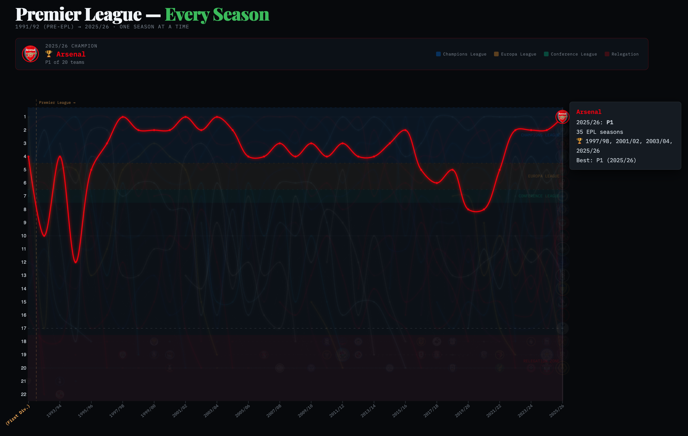
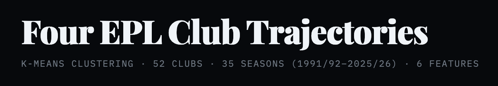

The English Premier League ([EPL](https://www.premierleague.com/en)) just wrapped its 34th season and in that time, 52 clubs played at least one season. Some clubs — Arsenal, Chelsea, Liverpool, Manchester City, Manchester United, Tottenham — never left (though Tottenham tried their damndest this year). 

The majority of the 52 teams are split into three other trajectories. Some joined late and never dropped — Brighton arrived in 2017 and stayed ever since. Some got relegated and never came back (Bolton, Coventry). Some yo-yoed — promoted, relegated, promoted again — with Burnley doing it so many times it became a personality trait (shoutout long-suffering Burnley superfan, Texans great JJ Watt).

I wanted to see the league's history unfold and visualize club trajectories in one chart. Also, the chance to use a data-driven statistical approach to cluster the teams was a puzzle I found interesting.

I also must confess that I'm an Arsenal fan — since 2005, a year after they last won the league. The Invincibles were the team I arrived too late to celebrate. My Gunner viewing experience consisted of twenty-two years of (mostly) top-four finishes, an appreciation for Wenger's imprint on the game (nutrition, training), but sadly, since that historic and undefeated 2004 season, twenty-two years of watching the title go somewhere else.

**[→ Open the interactive chart](https://kpolimis.github.io/epl-standings/)**

---

## What you're looking at

### Individual Teams and Seasons
Each line is one EPL club and the vertical axis (y-axis) is league position. First place is at the top and twentieth (or twenty-second, in the early years) is at the bottom. Each each season is a column and the animation transitions from season to season on the x-axis. Lines break where a team was relegated and didn't immediately come back.

### Grouped Teams (UEFA and Relegation)

The color bands signal groups of team that either qualify for [European football club competitions](https://en.wikipedia.org/wiki/UEFA_club_competitions) under the Union of European Football Association ([UEFA](https://www.uefa.com/)) or are relegated. The blue band at the top is the Champions League zone, currently teams that finish in the top 4 qualify for this competition. Teams that place 5th and 6th qualify for the Europa League and are in the yellow band. The green band is for the 7th place finisher who qualifies for the Conference League.

The red band at the bottom is the relegation zone where three teams are dropped to the second division (Championship), making way for the 3 teams from the Championship division that won promotion. More on relegation and how it works [here](https://groundhopperguides.com/promotion-and-relegation-in-english-soccer-football/).

Hover over any line to see that club's full history: how many seasons they've played, their titles, their best finish, and their lowest table performance.

---

## The stories the chart tells

### Arsenal's Drought - (2003/04 to 2025/26)

Arsenal won three titles in six years with their red line last cresting the league's top in 2003/04 — the season they went the entire league campaign unbeaten. Arsène Wenger's Invincibles side (Thierry Henry, Patrick Vieira, Robert Pires, Dennis Bergkamp, et al.)  won 26, drew 12, and lost none. It's the only time in the Premier League era a team completed an unblemished season.

Their line then dips; not catastrophically — they stayed top four for over a decade after that crowning achievement — but they had not won the title until this season. New York City Mayor [Zohran Mamdani](https://x.com/ArsenalN7/status/2057595185341608069) and other famous Arsenal fans like British politician [Jeremy Corbyn](https://x.com/jeremycorbyn/status/2056871974744273224), rapper [21 Savage](https://x.com/Arsenal/status/2057084379156058167) were publicly celebrating the long journey back to first. Even NBA rivals [Boston Celtics](https://x.com/celtics/status/2057501511081443688) and Joel Embiid (Philadelphia 76ers, winner of the 2026 First Round Playoff between the Celtics and 76ers) were able to share common cause and post celebratory Arsenal messages. I celebrated the way I know how, creating data visualizations.

### Manchester United's Generational Run (1992/93 to 2012/13)

The Red Devils, helmed by legendary manager Sir Alex Ferguson, (so [Fergalicious](https://www.youtube.com/watch?v=5T0utQ-XWGY#t=58s)) won the Premier League in 7 of the first 10 seasons of the new league. United would go on to win 6 more titles in the 16 years following years leaving Sir Alex Ferguson with 13 EPL titles in 26 seasons.

When Ferguson hung up his clipboard in 2013, United sat atop English football as the sport's most decorated club. What followed was... less Fergalicious. A revolving door of managers — Moyes, Van Gaal, Mourinho, Solskjær, Rangnick, Ten Hag — cycled through Old Trafford like DiCaprio girlfriends turning 25, none able to recapture the dynasty's old magic. As of the 2025–26 season, United sit 3rd in the Premier League table with 68 points — showing signs of life, but still chasing the ghost of a dynasty that may never return. For a club that once made winning feel inevitable, third place is progress. Or at least, that's what they're telling themselves at Old Trafford.

### Manchester City's decade

From 2011/12 — when they dramatically won the title on goal difference, on the last minute of the last day — City's line barely leaves the top two. Between 2017 and 2025 they won six league titles in eight years. With a 100 point season and an English treble among their many accomplishments. Their light-blue thread runs at the summit of English football for so long it started to look [inevitable](https://www.youtube.com/watch?v=Qm4kJasYueU#t=43s).

Legendary manager Pep Guardiola is retiring after the 2025/26 season with 6 EPL titles in 10 years including an unprecedented four titles in a row from 2021 to 2024. [Reporting suggests](https://www.nytimes.com/athletic/7289785/2026/05/20/man-city-enzo-maresca-manager-plans/) former Guardiola assistant and Chelsea boss Enzo Maresca will get the job, will he maintain City's grip on being a perennial title contender?

### Liverpool's Back? (2019/20 and 2024/25)

Liverpool's red line oscillates dramatically in the chart's early years. Second under Dalglish, near-misses, then a long absence from the top. They came close in 2014 — Gerrard's slip, three points dropped against Chelsea — and then Klopp arrived.

In 2019/20 they won the title with 99 points, their first league championship in 30 years. In 2024/25 they won it again under Arne Slot, equalling Manchester United's record of 20 English league titles. Yet after winning the league under Slot and a big summer of investment, 2025/26 has surprised with 12 league defeats and scrapping for Champions League football.

### Leicester City's Surprise (2015/16)

No chart about the Premier League omits this season. Leicester started the season with 5,000-1 odds of winning a title. Their squad was assembled for £57 million with at the time relative unknowns that would become household names including Riyad Mahrez, Jamie Vardy, N'Golo Kanté. Leicester's line spends most of its existence hugging the relegation zone or disappearing entirely — and then in 2016 it shoots, inexplicably, to first.

It remains the most improbable sporting result in the modern era almost as improbable as Leicester relegated for the second time in three years after they were recently relegated from the Championship.

---

## The teams that came and went

What I find most striking in the chart is the graveyard of gray lines — clubs that spent a decade or more in the Premier League and since drifted back to the Championship and beyond.

* Wimbledon: top half through the 90s, gone by 2000.
* Bolton Wanderers: a steady presence through the 2000s, relegated in 2012, never returned.
* Blackburn Rovers: champions in 1994/95 under Kenny Dalglish, funded by Jack Walker's millions. They've spent most of the last decade outside the top flight entirely.
* Middlesbrough, Sunderland (mostly), Bradford City, Barnsley — clubs that had their years in the sun and descended.

And then clubs coming the other way: Brentford arrived to top flight English football for the first time in over 70 years in 2021 and immediately carved out a mid-table existence. Sunderland is also back in 2025/26 after nearly a decade out of the top league.

---

## The four club trajectories

The visual patterns in the chart suggested a taxonomy. I ran a k-means cluster analysis on 35 seasons of position data for all 52 clubs — grouping teams by seasons played, when they first appeared, number of separate stints, and whether they're still in the league today. Four clusters were derived.

**Permanent fixtures (9 clubs).** Arsenal, Chelsea, Everton, Liverpool, Manchester United, and Tottenham feature in every season since 1992. Aston Villa, Newcastle, and Manchester City missed a handful of seasons between them — but all three average 33+ seasons in the top flight and are still here. The Big Six plus three.

**Yo-yo regulars (16 clubs).** West Ham, Crystal Palace, Burnley, Sunderland, Leicester, Leeds, Fulham, Wolves, Nottingham Forest, and others. These clubs average 14.9 seasons played across multiple stints — half still in the league, half not. Their lines in the chart are interrupted, broken, then resumed. Leicester won the title in one of their stints. Sunderland is back in 2025/26 after years away. The cluster with the most drama per season.

**EPL tourists (16 clubs).** Blackburn, Bolton, Coventry, Portsmouth, Wimbledon, Sheffield Wednesday — clubs that averaged 6.6 seasons, mostly in a single stint, and are now gone. Blackburn won the league in 1995 on Jack Walker's money. Most of this group never came close to that again. Their lines end mid-chart and don't come back.

**Modern era entrants (11 clubs).** Brentford, Brighton, Bournemouth, Stoke, Swansea, Hull — clubs whose EPL careers began after 2011. Most came briefly and left. Brighton is the outlier: nine consecutive seasons and still going.

The chart separates cleanly along these lines once you know to look for them.

**[→ Open the full cluster chart](https://kpolimis.github.io/epl-standings/trajectories.html)**

For the full technical walkthrough — feature extraction, k-means setup, elbow method, and the cluster visualization — see the [technical companion post](../../technical/epl-clustering-tutorial/).

---

## How I made it

**Data.** Standings are derived from actual match results via two sources: [football-data.co.uk](https://www.football-data.co.uk) (1993/94–present, primary) and [jalapic/engsoccerdata](https://github.com/jalapic/engsoccerdata) (1991/92–1992/93, the two seasons the primary doesn't cover). `fetch_standings.py` pulls both, runs the same points-table logic on each, and writes `data/standings_verified.json`. No hardcoding, no API key required.

**Chart generation.** `generate.py` reads that file, builds a JSON payload with every team's full position history, and writes a self-contained `index.html` using [D3.js](https://d3js.org). No build step, no npm, no server — the output is a single file that opens locally or deploys as a static page.

**Cluster visualization.** `generate_trajectories.py` runs the k-means analysis on `data/standings_verified.json` and produces `trajectories.html` — the companion chart grouping clubs by trajectory type. The full walkthrough is in the [technical companion post](../../technical/epl-clustering-tutorial/).

**Hosting.** Both charts are deployed via GitHub Pages — push to `main`, enable Pages in the repo settings, done.

The code is open source: **[github.com/kpolimis/epl-standings](https://github.com/kpolimis/epl-standings)**

If you spot a data error or want to add something, open an issue or a pull request.

---

*Standings data from official Premier League records. 2025/26 data reflects the table with one matchweek remaining.*
