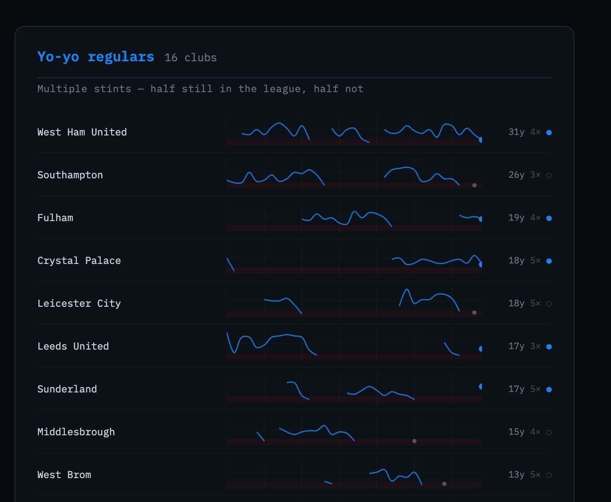
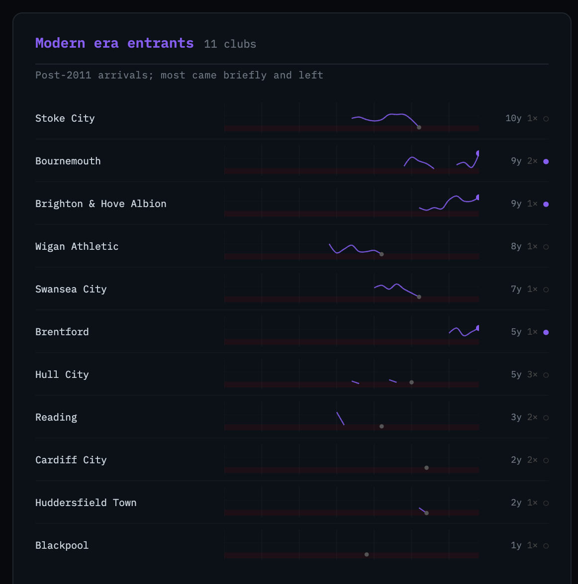

In a [companion post](../../blog/epl-standings/) I built an interactive chart showing every Premier League finish for all 52 clubs across 34 seasons. While building it, I noticed that the trajectory lines fell into recognizable shapes — some clubs always present, others flickering in and out, others appearing once and vanishing. The visual pattern suggested a taxonomy. This post is the technical walkthrough of how I formalized it with k-means clustering.

All code is available in the [project repository](https://github.com/kpolimis/epl-standings). The cluster visualization produced at the end of this post is at [trajectories.html](https://kpolimis.github.io/epl-standings/trajectories.html).

---

## Getting the data

Before clustering anything, we need verified standings. The initial version of this project had the standings hand-typed from memory — which produced at least one confirmed error (Coventry City shown as relegated in 1991/92 when they weren't) and unknown others. The right fix is to derive every table from actual match results.

The data pipeline lives in `fetch_standings.py`. Run it once before anything else:

```bash
python fetch_standings.py   # writes data/standings_verified.json
python generate.py          # reads that file, writes index.html
```

Two sources cover the full 35-season range:

| Source | Seasons | Notes |
|---|---|---|
| [football-data.co.uk](https://www.football-data.co.uk) | 1993/94 → 2025/26 | Primary. One schema, 32 years, free, no auth required. |
| [jalapic/engsoccerdata](https://github.com/jalapic/engsoccerdata) | 1991/92 + 1992/93 | Secondary — the only two seasons the primary doesn't cover. |

Both sources provide raw match results, not pre-computed tables. Every finishing position is derived using the same function:

```python
def build_table(matches):
    """
    matches: list of (home, away, home_goals, away_goals)
    Returns: {team_name: finishing_position}
    Tiebreakers: points → goal difference → goals scored.
    """
    pts = defaultdict(int)
    gf  = defaultdict(int)
    ga  = defaultdict(int)

    for home, away, hg, ag in matches:
        gf[home] += hg; ga[home] += ag
        gf[away] += ag; ga[away] += hg
        if   hg > ag: pts[home] += 3
        elif hg < ag: pts[away] += 3
        else:         pts[home] += 1; pts[away] += 1

    ranked = sorted(
        pts.keys(),
        key=lambda t: (-pts[t], -(gf[t] - ga[t]), -gf[t], t)
    )
    return {team: pos + 1 for pos, team in enumerate(ranked)}
```

The same `build_table()` runs on both sources. There's no mixing of pre-computed tables from different methodologies — just match results in, ranked finishing positions out. The secondary source is used for exactly two seasons, and that's documented explicitly in the script.

football-data.co.uk uses shortened team names (`"Man United"`, `"Nott'm Forest"`). A normalisation dict in `fetch_standings.py` maps these to the canonical names used everywhere else in the project before any table is built.

---

## The data

Once `fetch_standings.py` runs, `data/standings_verified.json` contains the merged output. `generate.py` auto-detects this file and uses it in preference to any hand-typed fallback. The structure is straightforward: for each of the 52 clubs, a `pos` array of length 35 records their league position in each season from 1991/92 through 2025/26. A `None` entry means the club wasn't in the top flight that season.

```python
import json

with open("data/standings_verified.json") as f:
    d = json.load(f)

seasons = d["seasons"]   # list of 35 season strings, e.g. "1992/93"
teams   = d["teams"]     # dict of 52 clubs
```

To get a sense of what we're working with:

```python
print(f"{len(seasons)} seasons, {len(teams)} clubs")
print(f"First season: {seasons[0]}, last: {seasons[-1]}")
print(f"\nArsenal pos array (first 10): {teams['Arsenal']['pos'][:10]}")
print(f"Barnsley pos array: {teams['Barnsley']['pos']}")
```

```
35 seasons, 52 clubs
First season: 1991/92 (First Div.), last: 2025/26

Arsenal pos array (first 10): [4, 10, 4, 12, 5, 3, 1, 2, 2, 2]
Barnsley pos array: [None, None, None, None, None, None, 19, None, ...]
```

Arsenal has a position in every slot — they've never been relegated. Barnsley has a single `19` in slot 6 (the 1997/98 season) and `None` everywhere else. That contrast is exactly what the clustering will formalize.

---

## Feature engineering

The raw `pos` array isn't suitable input for a clustering algorithm directly — it's a ragged time series with gaps. Instead, I extract six scalar features that summarize the shape of each club's EPL career.

```python
def extract_features(pos):
    present = [i for i, p in enumerate(pos) if p is not None]
    if not present:
        return None

    n_seasons    = len(present)           # total seasons in the EPL
    first_season = present[0]             # index of first EPL appearance
    last_season  = present[-1]            # index of last EPL appearance
    currently_in = 1 if pos[-1] is not None else 0  # in the league right now?

    # count separate stints — a new stint begins after any gap in presence
    stints = 1
    for i in range(1, len(present)):
        if present[i] != present[i - 1] + 1:
            stints += 1

    # longest unbroken run of consecutive seasons
    run, max_run = 1, 1
    for i in range(1, len(present)):
        run = run + 1 if present[i] == present[i - 1] + 1 else 1
        max_run = max(max_run, run)

    return [n_seasons, first_season, last_season, currently_in, stints, max_run]
```

A few notes on the feature choices:

- `n_seasons` separates long-tenured clubs from brief visitors.
- `first_season` distinguishes the founding members (index 0 or 1) from modern arrivals (index 20+).
- `currently_in` is a binary flag — it matters whether a club is still present.
- `stints` captures the yo-yo pattern directly. Arsenal has 1. Burnley has 5.
- `max_consecutive_run` distinguishes a club that played 18 scattered seasons from one that played 18 in a row.

---

## Scaling and clustering

k-means is sensitive to feature scale. `n_seasons` runs 1–35; `currently_in` is binary. Without standardization, seasons would dominate the distance calculation and the binary flags would contribute almost nothing.

```python
import numpy as np
from sklearn.preprocessing import StandardScaler
from sklearn.cluster import KMeans

team_names = [t for t in teams if extract_features(teams[t]["pos"]) is not None]
X = np.array([extract_features(teams[t]["pos"]) for t in team_names])

scaler   = StandardScaler()
X_scaled = scaler.fit_transform(X)
```

For k, I used 4. The three trajectory types visible in the chart — always present, yo-yo, one-time visitors — imply at least 3. When I ran the clustering, a fourth group separated cleanly: clubs that arrived after 2011 and have a distinct profile from the historic one-time visitors (later `first_season`, shorter `max_run`, several still present). Four clusters is defensible from the data.

```python
np.random.seed(42)
km = KMeans(n_clusters=4, n_init=20, random_state=42)
labels = km.fit_predict(X_scaled)
```

`n_init=20` runs the algorithm from 20 different random starting points and takes the best result. k-means can get stuck in local minima depending on initialization; running it multiple times reduces that risk.

---

## Results

Here are the four clusters, sorted by average seasons played.

```python
feature_cols = ["n_seasons", "first_season", "last_season",
                "currently_in", "stints", "max_consecutive_run"]

for c in sorted_clusters:
    members = [team_names[i] for i, l in enumerate(labels) if l == c]
    feats   = [extract_features(teams[t]["pos"]) for t in members]
    print(f"\nCluster {c} — {len(members)} clubs")
    print(f"  avg seasons:    {np.mean([f[0] for f in feats]):.1f}")
    print(f"  avg first idx:  {np.mean([f[1] for f in feats]):.1f}")
    print(f"  currently in:   {np.mean([f[3] for f in feats])*100:.0f}%")
    print(f"  avg stints:     {np.mean([f[4] for f in feats]):.2f}")
    print(f"  members: {', '.join(sorted(members))}")
```

```
Cluster — 9 clubs  [Permanent fixtures]
  avg seasons:    33.7
  avg first idx:  0.2
  currently in:   100%
  avg stints:     1.56
  members: Arsenal, Aston Villa, Chelsea, Everton, Liverpool,
           Manchester City, Manchester United, Newcastle United, Tottenham Hotspur

Cluster — 16 clubs  [Yo-yo regulars]
  avg seasons:    14.9
  avg first idx:  4.3
  currently in:   50%
  avg stints:     4.19
  members: Burnley, Crystal Palace, Fulham, Ipswich Town, Leeds United,
           Leicester City, Middlesbrough, Norwich City, Nottingham Forest,
           Sheffield United, Southampton, Sunderland, Watford, West Brom,
           West Ham United, Wolverhampton Wanderers

Cluster — 11 clubs  [Modern era entrants]
  avg seasons:    5.5
  avg first idx:  20.9
  currently in:   27%
  avg stints:     1.45
  members: Blackpool, Bournemouth, Brentford, Brighton & Hove Albion,
           Cardiff City, Huddersfield Town, Hull City, Reading,
           Stoke City, Swansea City, Wigan Athletic

Cluster — 16 clubs  [Departed regulars]
  avg seasons:    6.6
  avg first idx:  3.5
  currently in:   0%
  avg stints:     1.62
  members: Barnsley, Birmingham City, Blackburn Rovers, Bolton Wanderers,
           Bradford City, Charlton Athletic, Coventry City, Derby County,
           Luton Town, Notts County, Oldham Athletic, Portsmouth, QPR,
           Sheffield Wednesday, Swindon Town, Wimbledon
```

A few things worth noting in the results:

West Ham ends up in the yo-yo cluster despite 31 seasons — because they've had four separate stints, which pushes their `stints` feature above the permanent fixtures group. Whether that's correct is debatable; they're a borderline case.

Brighton lands in the modern entrants cluster, which is right on average-feature grounds — but their 9 consecutive seasons and current top-half standing make them the obvious outlier within that group. The cluster analysis surfaces the pattern; the interpretation still requires looking at the actual data.

The departed regulars and the yo-yo regulars have similar `first_season` averages (3.5 vs 4.3), meaning both groups were present early. What separates them is `stints` (1.62 vs 4.19) and `currently_in` (0% vs 50%). The departed regulars mostly had one sustained run and then dropped out permanently. The yo-yo clubs kept coming back.

---

## Visualizing the clusters

The companion script `generate_trajectories.py` takes the cluster assignments and produces a self-contained HTML file — `trajectories.html` — showing each club as a sparkline grouped by cluster. The y-axis is league position (1 at the top, 20 at the bottom); gaps in the line are absent seasons; a filled dot marks the last known season.

```bash
python generate_trajectories.py
# → trajectories.html
```

**[→ Open the trajectory cluster chart](https://kpolimis.github.io/epl-standings/trajectories.html)**





The four groups separate visually in a way that validates the clustering: the permanent fixtures run wall-to-wall; the yo-yo regulars have interrupted lines that resume; the modern entrants cluster in the right half of the chart; the departed regulars have lines that end and don't come back.

---

## What's next

A few natural extensions:

- **Elbow method or silhouette score** to validate k=4 rather than asserting it.
- **Hierarchical clustering** as a cross-check — does the dendrogram suggest the same groupings?
- **Add average position as a feature** — right now the clustering is purely about presence/absence patterns, not quality. Adding `avg_position` would distinguish Leicester (multiple stints, one title) from Norwich (multiple stints, never threatening the top half).
- **Temporal split** — run the clustering on just the first half of the dataset (1991–2008) and compare to the second half (2009–2026). Have the trajectory types shifted?

All code is in [github.com/kpolimis/epl-standings](https://github.com/kpolimis/epl-standings).
